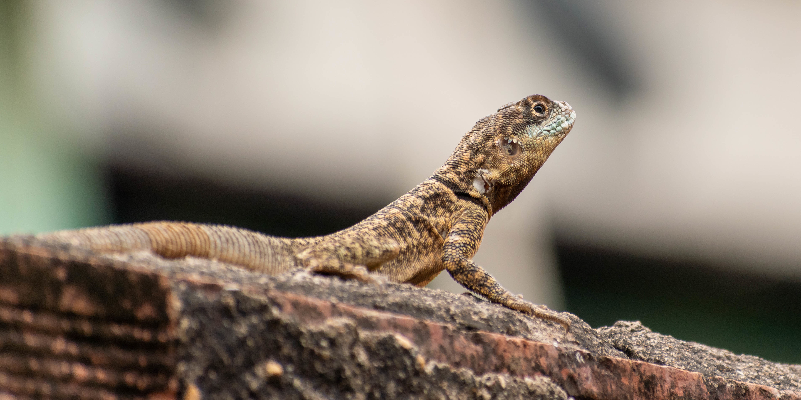

# Photo Spherical Sinusoidal Projection with Gores

This Python script processes an image by splitting it into gores, applying a spherical sinusoidal projection to each gore, and merging them back into a single output image.

## Features
- Splits an input image into degree-based gores.
- Applies spherical sinusoidal projection to each gore.
- Merges the processed gores into a single image.

## Requirements
The script requires the following Python packages:
- `Pillow` (for image processing)
- `numpy` (for numerical operations)

Install the required packages using pip:
```bash
pip install Pillow numpy
```

## Usage
Run the script from the command line with the following arguments:

```bash
python sinusoidal_gores.py --input <input_image> --output_dir <output_directory> --output_image <output_image> --degree_step <degree_step>
```

### Arguments
- `--input`: Path to the input image file.
- `--output_dir`: Path to the output directory where intermediate gores and processed files will be stored.
- `--output_image`: Path to save the final merged output image.
- `--degree_step` (optional): Degree step for splitting the image into gores. Default is `20` degrees.

### Example
To process an image `lizard.jpg`, split it into gores of 20 degrees (18 pieces), and save the output:

```bash
python sinusoidal_gores.py \
  --input world_map.jpg \
  --output_dir output_gores \
  --output_image final_projection.png \
  --degree_step 30
```



## How It Works

1. **Splitting the Image:**
   The script divides the input image into vertical gores based on the specified degree step (e.g., 20 degrees). These gores are saved as separate images in the output directory.

2. **Applying Projection:**
   Each gore undergoes a spherical sinusoidal transformation, which adjusts the pixels to simulate a spherical projection.

3. **Merging the Gores:**
   The transformed gores are stitched back together to form the final output image, which is saved to the specified path.

## Output
- **Intermediate Gores:** Saved in the specified output directory.
- **Final Image:** The merged image after projection is saved to the provided output file path.

## License
This project is licensed under the MIT License.

## Author
[Vinícius Vieira Mesquita]

